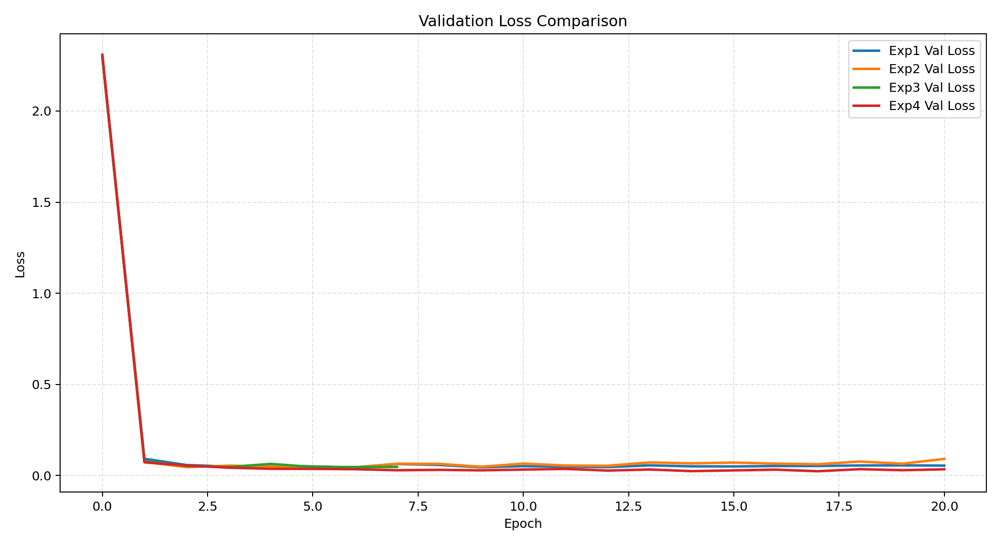
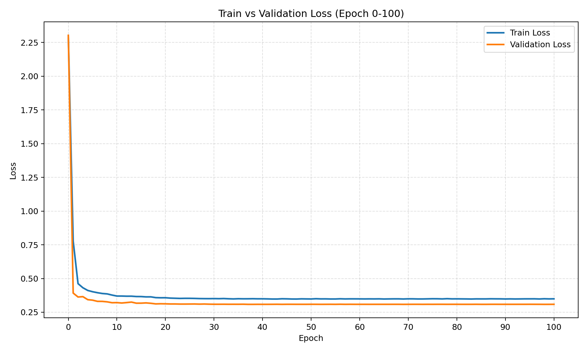

# 机器学习实验：基于 CNN 的手写数字识别

## 1. 学生信息

- **姓名**：待填写
- **学号**：待填写
- **班级**：待填写

> 注意：姓名和学号必须由本人填写，否则实验提交可能无效。

---

## 2. 实验概述

本实验基于 Kaggle Digit Recognizer 手写数字数据集，使用卷积神经网络完成手写数字分类。实验内容包括 CNN 模型训练、超参数对比、Kaggle 测试集预测提交，以及基于 Flask 的 Web 应用封装。最终 Kaggle Score 为 **0.99564**，超过实验要求的 0.98。

---

## 3. 实验环境

- Python 3.12
- PyTorch GPU 版
- torchvision
- matplotlib
- pandas / numpy / scikit-learn
- Flask
- GPU：NVIDIA GeForce RTX 4060 Laptop GPU

---

## 实验一：模型训练与超参数调优

### 1.1 实验目标

使用 CNN 在手写数字数据集上完成 0-9 十分类任务，通过超参数对比理解优化器、Batch Size、数据增强和 Early Stopping 对模型效果的影响，并生成 Kaggle 可提交的预测文件。

### 1.2 模型结构

4 组对比实验统一使用基础 CNN：

```text
输入(1x28x28) -> Conv1 + ReLU + MaxPool -> Conv2 + ReLU + MaxPool -> Flatten -> FC -> 输出(10类)
```

最终 Kaggle 提交模型在基础 CNN 上进一步加入 BatchNorm、Dropout、数据增强、AdamW、Label Smoothing 和学习率调度器，以提升泛化能力。

### 1.3 超参数对比实验结果

说明：Kaggle 官方测试集没有标签，因此 4 组对比实验的 Test Acc 不在本地计算；最终公开提交分数记录在 1.4。

| 实验编号 | 优化器 | 学习率 | Batch Size | 数据增强 | Early Stopping |
|----------|--------|--------|------------|----------|----------------|
| Exp1 | SGD | 0.01 | 64 | 否 | 否 |
| Exp2 | Adam | 0.001 | 64 | 否 | 否 |
| Exp3 | Adam | 0.001 | 128 | 否 | 是 |
| Exp4 | Adam | 0.001 | 64 | 是 | 是 |

| 实验编号 | Train Acc | Val Acc | Test Acc | 最低 Loss | 收敛 Epoch |
|----------|-----------|---------|----------|-----------|------------|
| Exp1 | 99.44% | 98.95% | 未逐组提交 | 0.0443 | 6 |
| Exp2 | 99.62% | 98.83% | 未逐组提交 | 0.0446 | 6 |
| Exp3 | 98.77% | 98.69% | 未逐组提交 | 0.0461 | 3 |
| Exp4 | 99.05% | 99.33% | 未逐组提交 | 0.0232 | 17 |

完整结果文件：`outputs/tables/comparison_results.csv`

### 1.4 最终提交模型配置

| 配置项 | 我的设置 |
|--------|---------|
| 优化器 | AdamW |
| 学习率 | 0.001 |
| Batch Size | 256 |
| 训练 Epoch 数 | 100 |
| 是否使用数据增强 | 是 |
| 数据增强方式 | RandomAffine(degrees=12, translate=(0.08, 0.08), scale=(0.95, 1.05)) |
| 是否使用 Early Stopping | 否，完整训练 100 epoch |
| 是否使用学习率调度器 | 是，ReduceLROnPlateau |
| 其他调整 | BatchNorm、Dropout、Label Smoothing=0.05 |
| **Kaggle Score** | **0.99564** |

最终模型文件：`models/final_cnn.pt`

Kaggle 提交文件：`outputs/submissions/submission_full_ensemble.csv`

### 1.5 Loss 曲线

4 组对比实验的验证集 Loss 曲线如下：



最终模型 0-100 epoch 的训练/验证 Loss 曲线如下：



### 1.6 分析问题

**Q1：Adam 和 SGD 的收敛速度有何差异？从实验结果中你观察到了什么？**

Adam 在前几个 epoch 内下降更快，Exp2 第 1 轮的验证集准确率已经达到 97.81%，说明自适应学习率能更快找到较好的方向。SGD 的收敛也很稳定，Exp1 在第 6 轮达到最低验证 Loss，但整体需要依赖 momentum 才能保持较好的优化速度。

**Q2：学习率对训练稳定性有什么影响？**

学习率过大会导致 Loss 波动甚至错过较优解，学习率过小会使训练变慢。本实验中 Adam 使用 0.001 整体较稳定；最终模型还加入 ReduceLROnPlateau，当验证集指标停滞时自动降低学习率，使后期训练更平滑。

**Q3：Batch Size 对模型泛化能力有什么影响？**

Batch Size 较小时，每次参数更新带有一定随机性，可能帮助模型跳出局部不稳定区域，但训练波动也更明显。Exp2 使用 batch size 64，Exp3 使用 batch size 128，二者都能达到较好效果；本次结果中 Exp3 由于 Early Stopping 较早停止，验证精度略低。

**Q4：Early Stopping 是否有效防止了过拟合？**

Early Stopping 能在验证集 Loss 不再改善时提前停止训练，避免继续记忆训练集。Exp3 在第 7 轮提前停止，减少了无效训练；Exp4 配合数据增强后继续训练到更低的验证 Loss，说明 Early Stopping 对防止过拟合是有效的，但 patience 设置需要结合数据增强和模型复杂度调整。

**Q5：数据增强是否提升了模型的泛化能力？为什么？**

数据增强提升了泛化能力。Exp4 使用随机仿射变换后，验证集最低 Loss 降到 0.0232，明显优于未增强的 Exp1-Exp3。原因是手写数字在真实场景中会出现轻微旋转、平移和缩放，数据增强让模型在训练时见到更多合理变形，从而减少对固定像素位置的依赖。

### 1.7 提交清单

- [x] 对比实验结果表格
- [x] 最终模型超参数配置
- [x] Loss 曲线图
- [x] 分析问题回答
- [x] Kaggle 预测结果 CSV
- [x] Kaggle Score：0.99564

---

## 实验二：模型封装与 Web 部署

### 2.1 实验目标

将训练好的 CNN 模型封装为 Web 应用，实现上传手写数字图片、模型预测并显示预测结果。

### 2.2 技术实现

本项目使用 Flask 实现 Web 应用，入口文件为 `app/app.py`。应用会自动加载 `models/final_cnn.pt`，并对上传图片进行灰度化、背景反色、居中裁剪、缩放到 28x28、标准化等预处理，然后输出预测类别和 Top-3 置信度。

### 2.3 项目结构

```text
digit-recognizer/
├── app/app.py
├── models/final_cnn.pt
├── requirements.txt
├── README.md
├── src/
├── data/
├── outputs/
└── report/
```

### 2.4 运行方式

```powershell
& 'E:\machining learning\.venv\Scripts\python.exe' .\app\app.py
```

本地访问地址：

```text
http://127.0.0.1:7860
```

### 2.5 提交信息

| 提交项 | 内容 |
|--------|------|
| GitHub 仓库地址 | 待上传后填写 |
| 在线访问链接 | 本地版本：http://127.0.0.1:7860；公网链接待部署后填写 |

### 2.6 提交清单

- [x] Web 应用代码
- [x] 模型加载与预测功能
- [x] 上传图片预测功能
- [ ] GitHub 仓库地址
- [ ] 公网在线访问链接
- [ ] 页面截图与预测结果截图

---

## 实验三：交互式手写识别系统

### 3.1 实验目标

在 Web 应用中加入手写板输入，支持用户直接在网页上手写数字并进行识别。

### 3.2 已实现功能

| 功能 | 实现情况 |
|------|----------|
| 手写输入 | 已使用 HTML Canvas 实现 |
| 实时识别 | 点击识别按钮后输出预测数字 |
| 连续使用 | 支持多次输入与重新识别 |

### 3.3 加分项

- 已显示 Top-3 预测结果及置信度。
- 页面会以条形图形式展示 Top-3 概率分布。

### 3.4 提交信息

| 提交项 | 内容 |
|--------|------|
| 在线访问链接 | 本地版本：http://127.0.0.1:7860；公网链接待部署后填写 |
| 实现了哪些加分项 | 手写板输入、Top-3 置信度展示 |

### 3.5 提交清单

- [x] 手写板输入功能
- [x] 手写输入识别结果
- [x] Top-3 置信度展示
- [ ] 公网在线系统链接
- [ ] 手写输入与识别结果截图

---

## 评分标准对应说明

| 项目 | 完成情况 |
|------|----------|
| 实验一：模型训练与调优 | 已完成 4 组对比实验、Loss 曲线、分析回答和 Kaggle 提交文件 |
| 实验二：Web 部署 | 已完成本地 Flask Web 应用，公网部署链接待上传平台后填写 |
| 实验三：交互系统 | 已完成手写板输入和 Top-3 置信度展示 |
